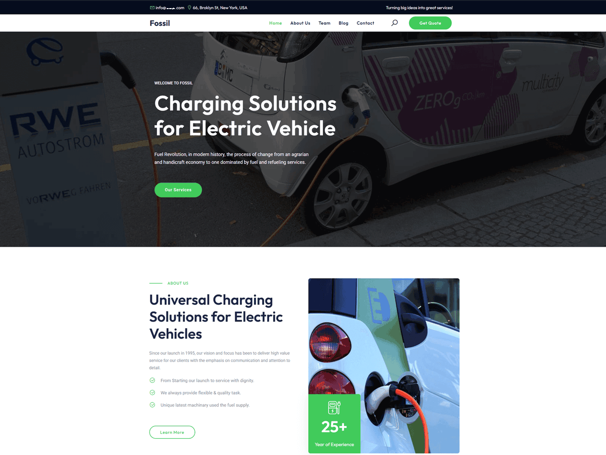

# Fossil - WordPress Theme for EV Charging & Gas Stations

Fossil is a clean, modern WordPress theme built for EV charging stations, gas stations, and energy-related businesses. Whether you're running a fuel station, promoting electric vehicle services, or offering eco-friendly energy solutions, Fossil makes it easy to create a professional website.

## 🔗 Links

| Version | Link |
|---------|------|
| **🆓 Free Version** | [Download from WordPress.org](https://wordpress.org/themes/fossil/) |
| **⭐ Pro Version** | [Get Fossil Pro](https://wpthemespace.com/product/fossil-pro-best-wordpress-theme-for-ev-charging-and-gas-stations/) |

---

## ✨ Features

- 🎨 **Clean & Modern Design** - Professional look perfect for energy businesses
- 📱 **Fully Responsive** - Looks great on all devices
- ⚡ **Fast Performance** - Optimized for speed
- 🔧 **Easy Customization** - No coding required
- 🎯 **SEO Friendly** - Built with best practices
- 🌐 **Translation Ready** - Supports multiple languages
- 🧩 **Elementor Compatible** - Works with popular page builders
- 📝 **Blog Ready** - Multiple blog layouts (Grid & Classic)
- 🎨 **Custom Header Styles** - Multiple header options
- 📍 **Breadcrumbs** - Built-in navigation breadcrumbs

## 🚀 Pro Version Features

Upgrade to [Fossil Pro](https://wpthemespace.com/product/fossil-pro-best-wordpress-theme-for-ev-charging-and-gas-stations/) for premium features:

- ✅ 50+ Premium Templates
- ✅ Unlimited Colors & Fonts
- ✅ Priority Support
- ✅ Lifetime Updates
- ✅ Advanced Customization Options
- ✅ Premium Starter Sites
- ✅ WooCommerce Ready
- ✅ And much more!

## 📋 Requirements

- WordPress 5.0 or higher
- PHP 5.6 or higher

## 🛠️ Installation

### From WordPress Dashboard:
1. Go to **Appearance → Themes → Add New**
2. Search for "Fossil"
3. Click **Install** and then **Activate**

### Manual Installation:
1. Download the theme from [WordPress.org](https://wordpress.org/themes/fossil/)
2. Go to **Appearance → Themes → Add New → Upload Theme**
3. Upload the zip file and click **Install Now**
4. Activate the theme

## 📖 Documentation

For detailed documentation and tutorials, visit our [Theme Documentation](https://wpthemespace.com/product/fossil-pro-best-wordpress-theme-for-ev-charging-and-gas-stations/).

## 🤝 Support

- **Free Version:** [WordPress.org Support Forum](https://wordpress.org/support/theme/fossil/)
- **Pro Version:** [Priority Support](https://wpthemespace.com/support/)

## 📝 Changelog

### Version 1.0.3
- Initial public release
- Core theme features
- Customizer options
- Multiple header styles
- Blog grid layout

## 📜 License

Fossil WordPress Theme is licensed under the [GNU General Public License v2 or later](http://opensource.org/licenses/gpl-2.0.php).

## 👨‍💻 Author

**Noor Alam** - [WP Theme Space](https://wpthemespace.com/)

---

### ⭐ Like this theme?

- Give it a ⭐ on GitHub
- [Rate it on WordPress.org](https://wordpress.org/support/theme/fossil/reviews/#new-post)
- [Get the Pro Version](https://wpthemespace.com/product/fossil-pro-best-wordpress-theme-for-ev-charging-and-gas-stations/)
